*2022-10-03*
# Raspberry Pi Proxy Server

Over the summer I took part in a cyber security training course, as part of this I defined a project I would undertake; the writeup I made as part of this project follows:

## Description and Aims
### Description of the project and aims outline in the project proposal:

Configure a proxy server on a Raspberry Pi to control internet traffic using Privoxy.
- Set up Raspberry Pi to be able to connect to it
- Install proxy software (Privoxy)
- Configure the proxy
- Configure browser/client to use the proxy
- Be able to browse the web whilst connected to the proxy
- Browse web with ads blocked correctly
- Further refine configuration beyond the basic setup
- Be able to use the Raspberry Pi/proxy server on a different network (bonus)
- Produce a report to document the process

## Process
### Setting up the Raspberry Pi

I already had a Raspberry Pi with the Raspbian OS install on the SD card, although it had not been used before.
I needed to enable SSH on the Pi so that I could access it remotely from my laptop, to do this I added a file called ‘ssh’ to /boot on the Pi, I also changed the default password to make the Pi more secure as I was enabling ssh. I did this by using a monitor and keyboard connected to the Pi, ssh would allow me to connect remotely instead.
Initially I had the Pi connected to my laptop directly, with an ethernet cable.
I could now ssh on to the Pi in order to set up the proxy server on it:

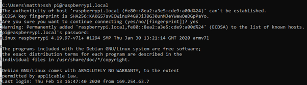

## Setting up the Proxy Server
### First Attempt

Initially I had errors with installing anything on the Pi.

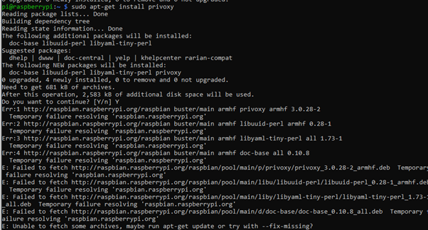

This was because the Pi was not able to connect to the internet through my laptop. I tried to fix this by enabling Internet Connection Sharing (ICS) from my network adapter with internet connection to the ethernet adapter connected to the Pi. However this still was not working.
The error seemed to be a DHCP error – my laptop (using ICS) should have assigned an IP to the Pi within the networks address range however this was not happening; the Pi was using its default IP:

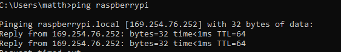

The Pi also did not have a default gateway so could not find a route to the network and therefore could not get internet access:

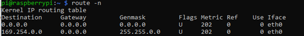

### Second Attempt

I connected the Raspberry Pi directly to my home router, this assigned the Pi an IP within the networks address range and fixed the error of having no internet connection:

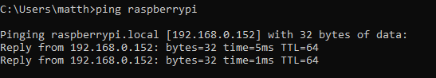

Next I could install Privoxy on the Pi:

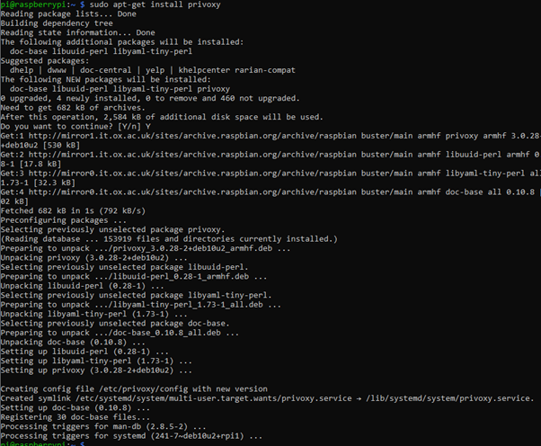

Following [this tutorial](https://www.howtogeek.com/683971/how-to-use-a-raspberry-pi-as-a-proxy-server-with-privoxy/) I changed the listen address setting in the Privoxy config file:

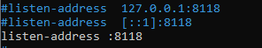

This is to allow the proxy server to accept connections from devices that its not running on. The proxy server uses port 8118.
I also added a line that would enable me to edit some of settings for the proxy server from its browser interface rather than needing to ssh into the Pi and change and save settings each time a change is made.
I verified that the service was running:

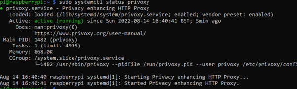

## Configure Client and Proxy
### Configure CLient to us Proxy Server

Enabling the proxy could either be done in the browser:

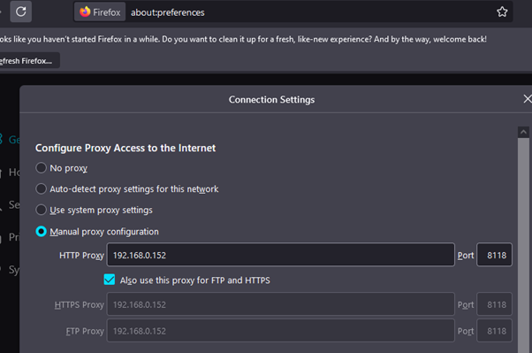

Or on my laptop itself:

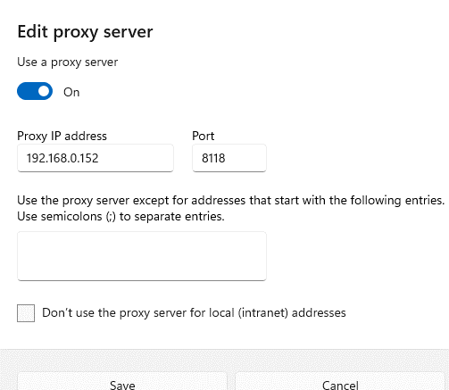

To check if the proxy is being used by the client by going to config.privoxy.org, if not being used by the client:

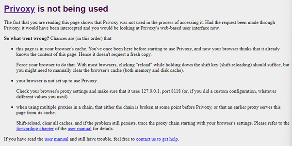

If being used:

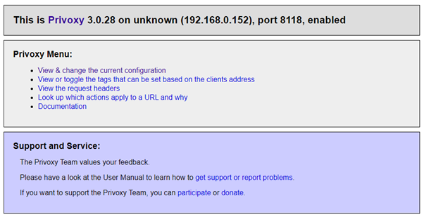

I verified that I could still browse the web whist connected to the proxy server which worked.

### Configure Proxy

I changed the ‘action file’ to one of the predefined sets of actions to block ads on the web:

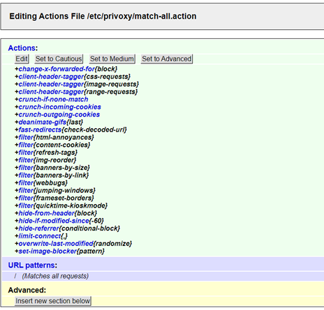

I tested browsing a website with ads without the proxy:

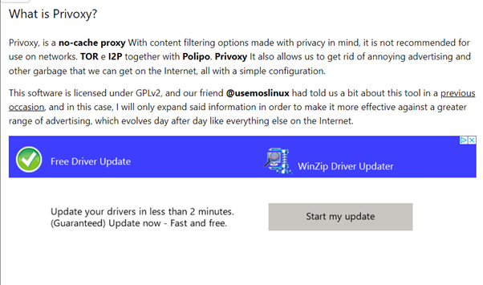

Then with the configured proxy:

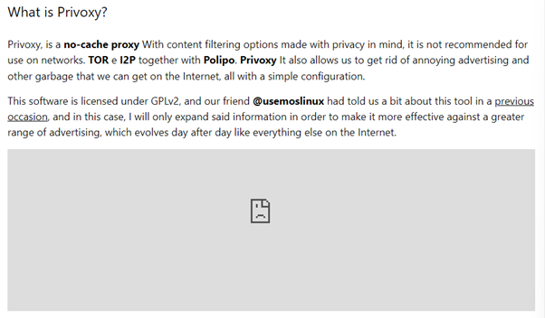

## Miscellaneous

Finding the IP of the Raspberry Pi – could use its hostname ‘raspberrypi / raspberrypi.local’ to ping/ssh but its IP address is also needed e.g. to configure client to use the proxy. I could use NMAP to find devices/IPs on the network or use the router’s browser interface to show its connected devices (once the Pi was connected directly to the router) or ping raspberrypi and see the IP that responds.

## Review
### Aims Met

-	[x] Set up Raspberry Pi to be able to connect to it 
-	[x] Install proxy software (Privoxy) 
-	[x] Configure the proxy
-	[x] Configure browser/client to use the proxy
-	[x] Be able to browse the web whilst connected to the proxy
- [x]	Browse web with ads blocked correctly
-	[ ] Further refine configuration beyond the basic setup (only used defaults)
-	[ ] Be able to use the Raspberry Pi/proxy server on a different network (bonus)
-	[x] Produce a report to document the process (this report!)

