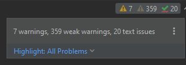

*2022-10-16*

During Year 2 of my university course I created a steganography tool for the programming module. The code can now be found [here](https://github.com/ATinyFish3/Simple-Steganography-Tool), what follows is an overview of the code:

# Prerequisite Fix

When I initially coded this project I was not using PyCharm, which I now do, and I found immediatly when using PyCharm that the TKinter GUI aspects did not work. This appear to be because no 'mainloop()' was called, so I [updated the code](https://github.com/ATinyFish3/Simple-Steganography-Tool/commit/6aca5f95e8777f1b9701ac6561815a515dc3f126) so it would work:

```
window = Tk()
filePath = askopenfilename()#(From tkinter library)  // Part of original code
window.mainloop()
```

Using PyCharm has also helped to identify other areas where the code can be improved - refining the code is something I will do after this writeup.



# What does the program do?

For this program you are presented with a menu with the options of encoding text in an image, decoding text from an image, or checking the least significant bits (LSBs) of an image (as this is where any text could be hidden):

```
Options:

[E]ncode
or
[D]ecode
or
[C]heck LSBs
or
[Q]uit

```

If you choose encode the program asks for some text to hide, whether you want to (admittedly badly) encrypt the text, and to select an image to hide the text in. Then a new image is saved with a user specified name which is imperceptibly different to the original image and which contains the hidden text. 

If you choose decode then the program asks you to select an image, it checks that the image actually contains hidden text (by looking for a flag that gets hidden with the text when encoding), then extracts the hidden text if it exists and prints the text to the console.

Checking the LSBs prints out all the characters of the image as if any of them could be hidden text so that the user can check an image themsevles (e.g. for stegaographic images not made using this specific program).

# Encoding

The main function for the encoding is the stegEncode() function. This function starts off by gettin guser input for the text to hide in an image:

```
messageContainsEndStatement = ''
    while messageContainsEndStatement != None:
        message = getText()#message will be the text to hide in the image
        messageContainsEndStatement = re.search(endStatement, message)#regex to search for endStatement in any part of the entered text
        if messageContainsEndStatement != None:
            print("Message cannot contain", endStatement)
            time.sleep(.5)
    message = message + endStatement
```

The 'endStatement' is a variable that holds the flag that gets added to the end of the user's text that is later used when decoding to find a message (and to know when the message ends). If the user enters the end statement as part of their text then their text may get cutoff or errors may occur, so this is checked for using a regex.

The getText() is a function to get text input with some validation:

```
def getText():#Function to get message to hide
    time.sleep(.4)
    clear()
    message = ''
    while len(message) == 0:#Check user enters non null message
        clear()
        print("Enter text to hide in your file:\n")
        message = input()
        if len(message) == 0:
            print("Enter at least some text!")
            time.sleep(1)
        
    return message
```

The user can then choose to encrypt their message - acheived through the messageEncrypt() function which converts each character to ASCII then adds a set value to each ASCII character to perform a simple Caeser Cipher:

```
def messageEncrypt(text):#Function to encrypt message
    textList = list(text)#Convert message to array so each character can be 

    count = 0#Variable to increment each item in the message
    for i in textList:
        i = ord(i)#Convert character to unicode code
        i = (i + cShift)%128#Caeser shift - mod 128 to avoid errors with nonprintable characters (0-127 unicode is ASCII)
        #(Ebrahim, 2020)
        i = i + uShift#Add 128 so characters are not printable (as looking at bits from image with no hidden message will look like this)
        i = chr(i)#Change unicode back to character
        textList[count] = i#Change original character to new character
        count += 1#Increment count

    text = "".join(textList)#Change the list of characters back into a string
    return text
```

The text is converted to binary with the textToBinary() function that uses one clever line to do this:
`messageBinary = ''.join(format(ord(i), '08b') for i in message)`

The user also selects an image; using TKinter this is done by opening the file explorer. There is validation for checking the file extension so the file is definitely an image.

```
def getImage():#Function to get the image the user wants to use
    imageFilePath = ''
    isImage = False#Flag to check that chosen file is an image
    while isImage == False:
        time.sleep(.5)
        clear()
        imageFilePath = getFile()

        if imageFilePath.lower().endswith(('.png', '.jpg', '.jpeg', '.bmp')):#Make sure file selected is an image
            #(How can I check the extension of a file?, 2011)
            isImage = True
            return imageFilePath

        else:#If chosen file not valid or no file chosen then give user option to cancel and show valid file formats
            print("Choose an image file (png, jpg, bmp)(press enter to continue)\nor [C]ancel\n")
            cancelChoice = input()
            if cancelChoice == 'C':
                print("Returning to menu\n")
                return False
              
def getFile():#Seperate this from just images so expansion easy (e.g. use same function to get path to sound files, text files...)
    print("Choose an image!\n")
    window = Tk()
    filePath = askopenfilename()#(From tkinter library)
    window.mainloop()
    #(Choosing a file in Python with simple Dialog, 2010)
    return filePath
```

Then the functions openImageBytes(), changeImageBytes() and binaryToImage() are called which converts the image to a NumPy array of bytes, changes the begining bytes to the bytes of the binary message then converts the final byte array back into an image. This stage also takes into account images with different colour bands (3,4).

```
def openImageBytes(path):#Function to get byte array of an image
    with Image.open(path) as img:#Open image
        width, height = img.size#Get width and height to be able to reshape array (change dimensions) to get data
        data = np.array(img)
        numBands = len(img.getbands())

    data = np.reshape(data, width*height*(len(img.getbands())))
    return data, width, height, numBands
   
def changeImageBytes(textBytes, imageBytes):#Function to put the bytes of the text in the bytes of the image
    pos = 0#Position variable to increment
    for i in textBytes:
        imageBytes[pos] = ((imageBytes[pos] & ~1) | int(i))#Replace LSB with correct bit from text bytes
        #(Replace least significant bit with bitwise operations, 2011)
        pos += 1#Increment to next byte
    #print(imageBytes)
    return imageBytes
    
def binaryToImage(binary, width, height, numBands):#Function to turn array of bytes to image
    binary = np.reshape(binary, (height, width, numBands))#Reshape byte array

    saveImg = Image.fromarray(binary)#Make image from array

    saveImage(saveImg)
```

saveImage() is a function that again uses TKinter and the file explorer to save the image, with regex validation on [Windows reserved words](https://learn.microsoft.com/en-gb/windows/win32/fileio/naming-a-file) which I found a file could erroneously be saved as when saving in this way. 

# Decoding

The main function for the decoding is the stegDecode() function. It starts by getting an image using the same getImage() function used for encoding, then gets the byte array for that image using the same openImageBytes() used for encoding.

The getMessage() function looks through each character in the array (converted to unicode):

```
for i in imgArray:
        c = chr(i)#Change unicode character from image into character
        
        message = message + c#Add character to message string
```
It checks the end of the message variable each time a character is added to it for the endStatement flag (and the encrypted equivalent). Once the flag is found it returns the message (without the flag), if no flag is found then it returns None.

```
if len(message) > len(endStatement):#checks message is long enough to contain end statement before checking if end statement is there so only one check performed rather than 2 when the subsequent checks are not needed
            if message[-len(endStatement):] == endStatement:#Check the last characters of the message to see if they are the end of message flag
                message = message[:-len(endStatement)]#Strip the last characters as not part of message
                return message, False#Set isEncrypted to False

            elif message[-len(endStatementEncrypt):] == endStatementEncrypt:#Check the last characters of the message to see if they are the end of message flag (encrypted)
                message = message[:-len(endStatementEncrypt)]#Strip the last characters as not part of message
                return message, True#Set isEncrypted to True

    print("No message found\n")
    return None, None#Return None if no message found
```

# Misc

## Checking LSBs

Checking the LSBs is a similar process to decoding but instead of looking for the endStratement flag all characters (converted to unicode) are printed to the screen.

## Menu

The menu is part of the main() loop such thqt it can be called repeatedly until a valid input is received - a technique used elsewhere in the program as well.

## UX

There are multiple sleep() commands so that the user has time to read console messages and the program can "flow" better. Performance could be greatly improved by removing these but this may worsen user experience.

## Testing and Improvements

The original testing I did was manual and the logical walkthrough of all paths that I tested can be seen in the [Testing.md](https://github.com/ATinyFish3/Simple-Steganography-Tool/blob/main/Testing.md) file. A future post here may be the improvements made to the program and implementing unit tests.

