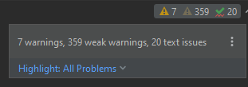

*2022-10-16*

During Year 2 of my university course I created a steganography tool for the programming module. The code can now be found [here](https://github.com/ATinyFish3/Simple-Steganography-Tool), what follows is a breakdown of the code:

# Prerequisite Fix

When I initially coded this project I was not using PyCharm, which I now do, and I found immediatly when using PyCharm that the TKinter GUI aspects did not work. This appear to be because no 'mainloop()' was called, so I [updated the code](https://github.com/ATinyFish3/Simple-Steganography-Tool/commit/6aca5f95e8777f1b9701ac6561815a515dc3f126) so it would work:

```
window = Tk()
filePath = askopenfilename()#(From tkinter library)  // Part of original code
window.mainloop()
```

Using PyCharm has also helped to identify other areas where the code can be improved - refining the code is something I will do after this writeup.


# What does the program do?

For this program you are presented with a menu with the options of encoding text in an image, decoding text from an image, or checking the least significant bits (LSBs) of an image (as this is where any text could be hidden):

```
Options:

[E]ncode
or
[D]ecode
or
[C]heck LSBs
or
[Q]uit

```

If you choose encode the program asks for some text to hide, whether you want to (admittedly badly) encrypt the text, and to select an image to hide the text in. Then a new image is saved with a user specified name which is imperceptibly different to the original image and which contains the hidden text. 

If you choose decode then the program asks you to select an image, it checks that the image actually contains hidden text (by looking for a flag that gets hidden with the text when encoding), then extracts the hidden text if it exists and prints the text to the console.

Checking the LSBs prints out all the characters of the image as if any of them could be hidden text so that the user can check an image themsevles (e.g. for stegaographic images not made using this specific program).

# Encoding

